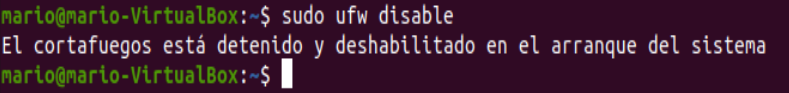

# Bootcamp de Redes 1

## Interfaces, Direcciones y Herramientas

## Datos:

**Nombre:** Mario Alberto Víquez González

**Carné:** B78443

**Curso:** Redes de Comunicación de Datos.

**Grupo:** 01

**Fecha:** 19/08/2020

 
## Pregunta 1

**¿Qué es una interfaz de red?**

Una interfaz de red es, en resumidas cuentas, cualquier manera que tenga el computador para comunicarse con el exterior. Es el punto de interconexión entre una computadora y una red pública o privada. Usualmente suele ser una tarjeta de interfaz de red, pero no necesariamente debe ser física, puede ser implementada en software. Ésta define las operaciones y servicios primitivos que pone la capa más baja a disposición de la capa superior inmediata.

**¿Cómo se identifica una interfaz de red?**

Podemos identificar las diferentes interfaces de red de manera física o a nivel de software, estos últimos los podemos ver mediante el comando **ifconfig**, el cual nos brinda numerosos parámetros de las interfaces red, como la dirección IP, máscaras de red entre otros.
En términos generales para identificar una interfaz de red es necesario la IP y la máscara, ya que a una interfaz se le debe asignar una dirección IP que sirve como su identificador cuando se comunica con el resto del mundo

**¿Qué potenciales interfaces de red puede identificar en su computador?**

Podemos encontrar las más típicas como lo son las siguientes: Ethernet, Wi Fi, Bluetooth, USB, GPS, Radio, NFC entre otros.

**Incluya el resultado de ejecutar “ifconfig” en su computadora, y marque los campos más importantes**

Se marcó enp0s3 ya que es el nombre de la interfaz, el IP, la netmask que es la mascara, Ethernet  y Broadcast.

## Pregunta 2
**En el universo de TCP/IP, ¿Qué es un “host”?**
Un host es un conjunto de nodos, computadoras o dispositivos que se encuentran conectados a una red que proveen y utilizan servicios de ella, estos ofrecen servicios de transferencia de archivos y conexión remota a otros computadores a los que se les llama clientes. En el universo TCP / IP , cada host tiene un número de host que, junto con una identidad de red, forma su propia dirección IP única. Este tipo de host en el universo TCP / IP no reenvía paquetes IP a otras redes TCP / IP, más bien un host suele tener una única interfaz (tarjeta de red) y es el destino o la fuente de los paquetes TCP / IP.

**En el universo de TCP/IP, ¿Qué es una “red”?**
Una red es un conjunto de dispositivos interconectados entre sí a través de un medio, que intercambian información y comparten recursos. En el universo de TCP/IP. Cuando se habla de redes TCP/IP, siempre estará presente el término  datagrama. Lo más importante de una red en el universo de TCP/IP  es que permite el envío y reenvío de paquetes, haciendo que el usuario tenga la ilusión de que trabaja en una única máquina.

## Pregunta 3
**¿Qué es la interfaz loopback?**
La interfaz Loopback es una interfaz virtual la cual tiene la peculiaridad de que siempre está activa y disponible despues de haber sido configurada. Esta no se encuentra vinculada a la direccion 127.0.0.1. Es una interfaz como cualquier otra a la cual se le puede asignar su propia direccion.

**¿Para qué sirve?**
Se utiliza a menudo como dirección de terminación para algunos protocolos de enrutamiento, esto porque tiene la peculiaridad de que nunca se cae. Otro uso común de una dirección de loopback es identificar un enrutador (se utiliza para identificar el dispositivo). La dirección de loopback es una dirección especial que los hosts utilizan para dirigir el tráfico hacia ellos mismos, es por eso que suele utilizarse tambien cuando una transmisión de datos tiene como destino el propio host.

**¿Es accesible desde el exterior?** 
No, cualquier datagrama de IP con una dirección de origen o destino configurada como una dirección de loopback no debe aparecer fuera de un sistema informático ni ser enrutado por ningún dispositivo de enrutamiento. De hecho los paquetes que fueron recibidos con una direccion de loopback deben descartarse (pueden ser maliciosos), estos reciben el nombre de Martian packets.

**¿El nombre localhost es un hostname que es visible desde el exterior?**
No,  basicamente  por que localhost es una especie de servidor local donde la IP esta redireccionada a si misma, y se conecta al servidor a si mismo, de hecho el protocolo tampoco acepta peticiones externas enviadas a 127.0.0.1, ya que si lo hicieran los atacantes podrían intentar entrar en el sistema. Los paquetes que aparecen en el Internet público desde direcciones IP reservadas como 127.0.0.1 se conocen como martian packets o paquetes marcianos.

## Pregunta 4
**¿Qué es un firewall?** 
Un firewall es, en resumidas cuentas servidores de seguridad. El firewall actúa como un filtro de paquetes. Inspecciona todos y cada uno de los paquetes entrantes y salientes.  Basicamente este controla el acceso de una computadora a la red y de elementos de la red a la computadora, por motivos de seguridad. Su funcionamiento radica en establecer una barrera entre su red interna y el tráfico entrante de fuentes externas (como Internet) para bloquear el tráfico malicioso como virus y piratas informáticos, proteginendo asi los equipos individuales, servidores  o equipos conectados en red.

**¿Cómo pueden verificar si tienen un firewall operativo en su máquina?**
Mediante el comando **sudo ufw status verbose** se puede observar el estado del firewall, si está o no activo .

Como se pudo observar, el firewall se encontraba inactivo, con el comando **sudo ufw enable** el firewall es habilitado.

**¿Cómo lo deshabilitan?**
Con el comando **sudo ufw disable** el firewall es detenido o deshabilitado 

## Pregunta 5
**¿Qué es un puerto?**

**Si se usa el puerto n en TCP, ¿se puede usar al mismo tiempo en UDP? ¿Por qué sí o por qué no?**

**¿Qué son los “puertos bien conocidos”?**

**¿Por qué los puertos debajo de 1024 están reservados?**

## Pregunta 6

**Utilice el comando nc (netcat) para abrir un servidor de su lado, en un puerto escogido por usted. Usando las asignaciones indicadas en el documento compartido de Google, publique el número de puerto en el que va a escuchar. Verifique que le llega comunicación de A o de B (según corresponda). Luego envíe un mensaje a A o a B según corresponda. Ponga el nc en modo verboso para que pueda ver lo que está sucediendo. Incluya el listado de todo lo sucedido con esta entrega.**

## Pregunta 7
**Usando nc en modo cliente, contáctese con un servidor web y solicite la página de índice. Indique cuál servidor, y la respuesta recibida.**

## Pregunta 8
**Usando nc y la bandera -z, verifique qué puertos están abiertos en la máquina A o B (según corresponda. Incluya el resultado en la entrega.**

## Referencias

- ####  How, K. (2018). Localhost. Retrieved 20 August 2020, from https://www.ionos.es/digitalguide/servidores/know-how/localhost/
- #### Firewall. Que es, para que sirve, como funciona, tiene limitaciones?. (2013). Retrieved 20 August 2020, from https://geekland.eu/que-es-y-para-que-sirve-un-firewall/
- #### Tanenbaum, A. S. (2003). _Redes de computadoras_. Pearson educación.
- #### What is a Firewall?. (2018). Retrieved 20 August 2020, from https://www.forcepoint.com/cyber-edu/firewall
- 
