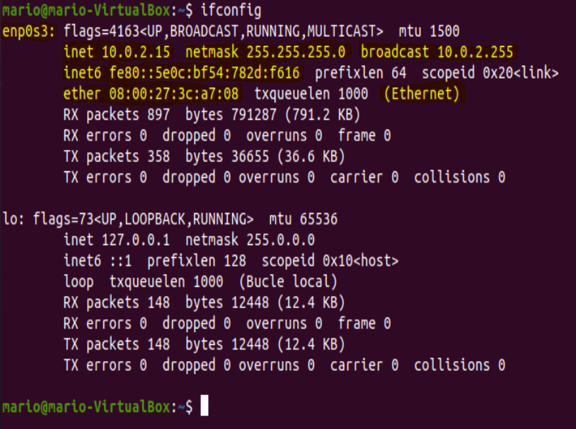
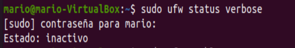
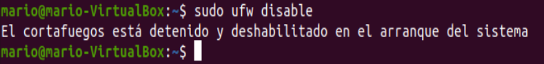
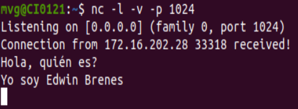
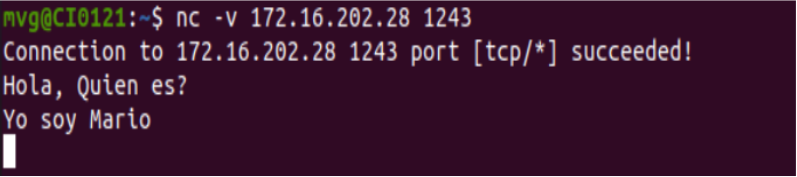
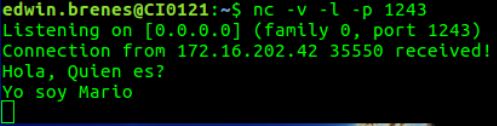
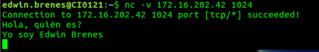
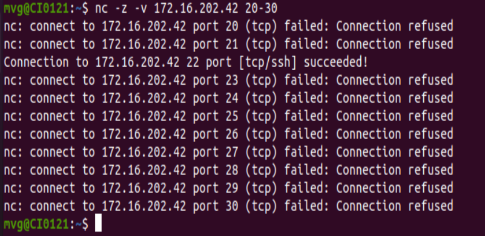
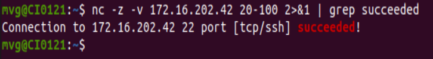
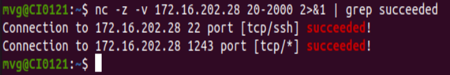

# Bootcamp de Redes 1

  

## Interfaces, Direcciones y Herramientas

  

## Datos:

  

**Nombre:** Mario Alberto Víquez González

  

**Carné:** B78443

  

**Curso:** Redes de Comunicación de Datos.

  

**Grupo:** 01

  

**Fecha:** 19/08/2020

  

## Pregunta 1

  

**¿Qué es una interfaz de red?**

  

Una interfaz de red es, en resumidas cuentas, cualquier manera que tenga el computador para comunicarse con el exterior. Es el punto de interconexión entre una computadora y una red pública o privada. Usualmente suele ser una tarjeta de interfaz de red, pero no necesariamente debe ser física, puede ser implementada en software. Ésta define las operaciones y servicios primitivos que pone la capa más baja a disposición de la capa superior inmediata.

  

**¿Cómo se identifica una interfaz de red?**

  

Podemos identificar las diferentes interfaces de red de manera física o a nivel de software, estos últimos los podemos ver mediante el comando **ifconfig**, el cual nos brinda numerosos parámetros de las interfaces red, como la dirección IP, máscaras de red entre otros.

En términos generales para identificar una interfaz de red es necesario la IP y la máscara, ya que a una interfaz se le debe asignar una dirección IP que sirve como su identificador cuando se comunica con el resto del mundo.

  

**¿Qué potenciales interfaces de red puede identificar en su computador?**

  

Podemos encontrar las más típicas como lo son las siguientes: Ethernet, Wi Fi, Bluetooth, USB, GPS, Radio, NFC entre otros.

  

**Incluya el resultado de ejecutar “ifconfig” en su computadora, y marque los campos más importantes**

  

  

Se marcó enp0s3, ya que es el nombre de la interfaz, el IP que es la inet, la netmask que es la máscara, Ethernet y Broadcast.

  

## Pregunta 2

**En el universo de TCP/IP, ¿Qué es un “host”?**

Un host o un sistema terminal, es un conjunto de nodos, computadoras o dispositivos que se encuentran conectados a una red que proveen y utilizan servicios de ella, estos ofrecen servicios de transferencia de archivos y conexión remota a otros computadores a los que se les llama clientes. Los sistemas terminales se conectan entre sí mediante una red de enlaces de comunicaciones y conmutadores de paquetes. En el universo TCP / IP , cada host tiene un número de host que, junto con una identidad de red, forma su propia dirección IP única. Este tipo de host en el universo TCP / IP no envía paquetes IP a otras redes TCP / IP, más bien un host suele tener una única interfaz (tarjeta de red) y es el destino o la fuente de los paquetes TCP / IP.

  

**En el universo de TCP/IP, ¿Qué es una “red”?**

Una red es un conjunto de dispositivos interconectados entre sí a través de un medio, que intercambian información y comparten recursos. En el universo de TCP/IP. Cuando se habla de redes TCP/IP, siempre estará presente el término datagrama. Lo más importante de una red en el universo de TCP/IP es que permite el envío y reenvío de paquetes, haciendo que el usuario tenga la ilusión de que trabaja en una única máquina.

  

**Usando la salida de ifconfig del ejercicio anterior, indique cuál es la red a la que está conectada cada interfaz, y cuál es el número de host respectivo.**

  

  

Es importante destacar que las direcciones IP que se usan como direcciones de red y de host no son fijas, por lo que las direcciones de red y host no se pueden determinar a menos que se disponga de más información.

  

Los primeros 24 bits (el número de unos de la máscara de subred) se identifican como la dirección de red y los últimos ocho bits (el número de ceros restantes de la máscara) constituyen la dirección del host.

  

Dicho esto ultimo, al tener la dirección IP como 172.16.202.42 , y la máscara como 255.255.255.0 , para la interfaz de nombre enp0s3, la red a la que está conectada y el número de host corresponden a **172.16.202.0** y **0.0.0.42** respectivamente.

  

## Pregunta 3

**¿Qué es la interfaz loopback?**

La interfaz Loopback es una interfaz virtual la cual tiene la peculiaridad de que siempre está activa y disponible después de haber sido configurada. Esta no se encuentra vinculada a la dirección 127.0.0.1. Es una interfaz como cualquier otra a la cual se le puede asignar su propia dirección.

  

**¿Para qué sirve?**

Se utiliza a menudo como dirección de terminación para algunos protocolos de enrutamiento, esto porque tiene la peculiaridad de que nunca se cae. Otro uso común de una dirección de loopback es identificar un enrutador (se utiliza para identificar el dispositivo). La dirección de loopback es una dirección especial que los hosts utilizan para dirigir el tráfico hacia ellos mismos, es por eso que suele utilizarse también cuando una transmisión de datos tiene como destino el propio host.

  

**¿Es accesible desde el exterior?**

No, cualquier datagrama de IP con una dirección de origen o destino configurada como una dirección de loopback no debe aparecer fuera de un sistema informático ni ser enrutado por ningún dispositivo de enrutamiento. De hecho los paquetes que fueron recibidos con una dirección de loopback deben descartarse (pueden ser maliciosos), estos reciben el nombre de Martian packets. En general, sólo es accesible desde una red local.

  

**¿El nombre localhost es un hostname que es visible desde el exterior?**

No, básicamente porque localhost es una especie de servidor local donde la IP está redireccionada a sí misma, y se conecta al servidor a sí mismo, de hecho el protocolo tampoco acepta peticiones externas enviadas a 127.0.0.1, ya que si lo hicieran los atacantes podrían intentar entrar en el sistema. Los paquetes que aparecen en el Internet público desde direcciones IP reservadas como 127.0.0.1 se conocen como martian packets o paquetes marcianos.

  

## Pregunta 4

**¿Qué es un firewall?**

Un firewall es, en resumidas cuentas, servidores de seguridad. El firewall actúa como un filtro de paquetes. Inspecciona todos y cada uno de los paquetes entrantes y salientes. Básicamente este controla el acceso de una computadora a la red y de elementos de la red a la computadora, por motivos de seguridad. Su funcionamiento radica en establecer una barrera entre su red interna y el tráfico entrante de fuentes externas (como Internet) para bloquear el tráfico malicioso como virus y piratas informáticos, protegiendo así los equipos individuales, servidores o equipos conectados en red.

  

**¿Cómo pueden verificar si tienen un firewall operativo en su máquina?**

Mediante el comando **sudo ufw status verbose** se puede observar el estado del firewall, si está o no activo .

  

  

Como se pudo observar, el firewall se encontraba inactivo, con el comando **sudo ufw enable** el firewall está habilitado.

  

  

**¿Cómo lo deshabilitan?**

Con el comando **sudo ufw disable** el firewall es detenido o deshabilitado

  

  

## Pregunta 5

**¿Qué es un puerto?**

Un puerto es en esencia, un número o un punto final de comunicación entre computadoras. Esto corresponde a una construcción lógica que identifica un proceso en particular o un tipo de servicio de red.

  

**Si se usa el puerto n en TCP, ¿se puede usar al mismo tiempo en UDP? ¿Por qué sí o por qué no?**

Sí, diferentes aplicaciones pueden unirse al mismo puerto en diferentes protocolos de transporte. Esto debido a que los puertos no son dependientes estrictamente del protocolo. De hecho los grupos de puertos para cada protocolo son completamente independientes, pero para los protocolos de nivel superior que pueden usar TCP o UDP, es una convención que usen el mismo número de puerto por defecto .

  

**¿Qué son los “puertos bien conocidos”?**

Según el Libro de Redes de computadoras, los números de puerto pertenecientes al rango de 0 a 1023 se conocen como números de puertos bien conocidos y son restringidos.

  

**¿Por qué los puertos debajo de 1024 están reservados?**

Como mencionamos en la pregunta anterior, los puertos que se encuentran en el rango de 0 a 1023 son restringidos, lo que significa que están reservados para ser empleados por los protocolos de aplicación bien conocidos,

como por ejemplo HTTP (que utiliza el número de puerto 80) y FTP (que utiliza el número de puerto 21). Los números de puerto por debajo de 1024 están reservados para su uso por el sistema (para el usuario root).

  

## Pregunta 6

  

**Utilice el comando nc (netcat) para abrir un servidor de su lado, en un puerto escogido por usted. Usando las asignaciones indicadas en el documento compartido de Google, publique el número de puerto en el que va a escuchar. Verifique que le llega comunicación de A o de B (según corresponda). Luego envíe un mensaje a A o a B según corresponda. Ponga el nc en modo verboso para que pueda ver lo que está sucediendo. Incluya el listado de todo lo sucedido con esta entrega.**

  

Para este ejercicio se trabajó con el estudiante Edwin Brenes, cuyos datos que usamos para establecer las pruebas de envío de mensajes fueron los siguientes:

  

**Máquina A**

Edwin Brenes IP: 172.16.202.28 Port: 1243

**Máquina B**

Mario Víquez IP: 172.16.202.42 Port: 1024

  

Importante destacar que mediante estos comandos, es posible ver los diferentes resultados y cómo se establecen las conexiones entre las máquinas.

  

server: nc -v -l -p PORT

client: nc -v IP PORT

  
  

De acuerdo a esto, estuvimos rotando el papel de máquina A o B (server y cliente) para verificar si se enviaban y recibían los mensajes satisfactoriamente.

  

Resultado de Máquina B (Mario) al conectarse y recibir mensajes desde la máquina A (Edwin)

  

  

Resultado de Máquina B (Mario) al conectarse y enviar mensajes a la máquina A (Edwin)

  

  

Resultado de Máquina A (Edwin) al conectarse y recibir mensajes desde la máquina B (Mario)

  

  

Resultado de Máquina A (Edwin) al conectarse y enviar mensajes a la máquina B (Mario)

  

  

## Pregunta 7

**Usando nc en modo cliente, contáctese con un servidor web y solicite la página de índice. Indique cuál servidor, y la respuesta recibida.**

  

Para hacer esta prueba se uso como servidor web el de Facebook, el cual es el siguiente 185.60.216.35, y el puerto donde típicamente se hacen los HTTP request que es el 80, la respuesta obtenida fue la página de índice (index), al solicitarla mediante el comando GET / HTTP/ index.html/1.1

  

	mvg@CI0121:~$ nc 185.60.216.35 80 -v

	  

	Connection to 185.60.216.35 80 port [tcp/http] succeeded!

	  

	GET/HTTP/index.html/1.1

	  

	HTTP/1.1 400 Bad Request

	  

	Content-Type: text/html; charset=utf-8

	  

	Date: Thu, 20 Aug 2020 22:50:53 GMT

	  

	Connection: close

	  

	Content-Length: 2959

	  
	  

	<!DOCTYPE html>

	  

	<html lang="en" id="facebook">

	  

	<head>

	  

	<title>Facebook | Error</title>

	  

	<meta charset="utf-8">

	  

	<meta http-equiv="cache-control" content="no-cache">

	  

	<meta http-equiv="cache-control" content="no-store">

	  

	<meta http-equiv="cache-control" content="max-age=0">

	  

	<meta http-equiv="expires" content="-1">

	  

	<meta http-equiv="pragma" content="no-cache">

	  

	<meta name="robots" content="noindex,nofollow">

	  

	

	  

	</head>

	  

	<body>

	  

	

	  

	

	  

	

	  

	

	  

	<h1 id="sorry">Sorry, something went wrong.</h1>

	  

	

	  

	We're working on it and we'll get it fixed as soon as we can.

	  

	

	  

	

	  

	<a id="back" href="//www.facebook.com/">Go Back</a>

	  

	

	  

	

	  

	Facebook

	  

	

	  

	&copy; 2020

	  

	

	  

	

	  

	&#183;

	  

	<a id="help" href="//www.facebook.com/help/">Help Center</a>

	  

	

	  

	

	  

	

	  

	

	  

	</body>

	  

	</html>

  

## Pregunta 8

**Usando nc y la bandera -z, verifique qué puertos están abiertos en la máquina A o B (según corresponda. Incluya el resultado en la entrega.**

  

Como tal, no podemos obtener absolutamente todos los puertos abiertos en una máquina, o al menos que se notifiquen todos a través de un comando en particular usando nc, pero podemos asignar un rango de puertos para probar cuales se encuentran abiertos o no, si estos no están disponibles no se podrán conectar y saldrá un mensaje que dice **failed: Connection refused**, por el contrario saldrá.

  

  

Por otro lado, si utilizamos la utilidad **grep**, podemos hacer una especie de filtrado con las conexiones que se encuentran únicamente abiertas dentro del rango establecido, gracias a que **grep** permite tomar una expresión regular de la línea de comandos, leer la entrada estándar o una lista de archivos, e imprime las líneas que contengan coincidencias para la expresión regular (en este caso, los puertos abiertos).

  

  

Un dato interesante es que si una máquina se encuentra en espera a recibir un mensaje, con un puerto debidamente asignado, si queremos consultar ese puerto, este aparece como abierto, sin embargo, una vez ejecutado el comando, el puerto se cierra y es necesario volver a habilitar la máquina en modo listening para poder observar el puerto abierto.

  

## Referencias

  

- #### How, K. (2018). Localhost. Retrieved 20 August 2020, from https://www.ionos.es/digitalguide/servidores/know-how/localhost/

- #### Firewall. Que es, para que sirve, como funciona, tiene limitaciones?. (2013). Retrieved 20 August 2020, from https://geekland.eu/que-es-y-para-que-sirve-un-firewall/

- #### Tanenbaum, A. S. (2003). _Redes de computadoras_. Pearson educación.

- #### What is a Firewall?. (2018). Retrieved 20 August 2020, from https://www.forcepoint.com/cyber-edu/firewall

- #### What is Network Port?. (2020). Retrieved 21 August 2020, from https://www.tutorialspoint.com/what-is-network-port
