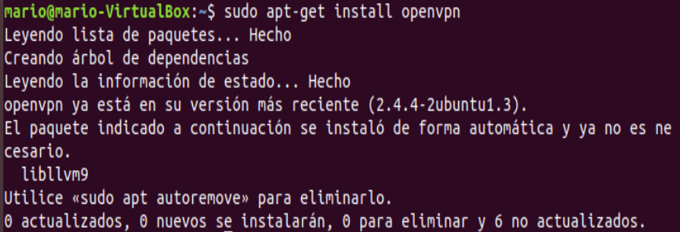
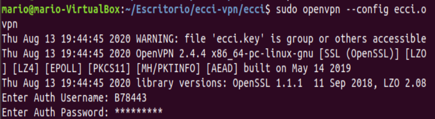
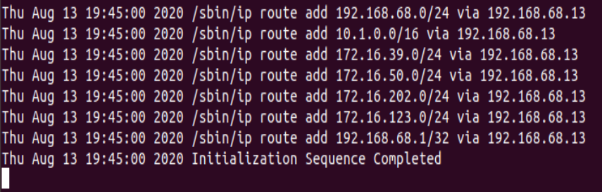
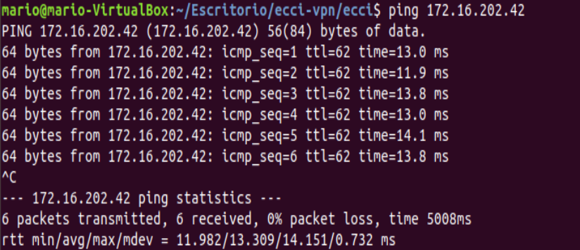
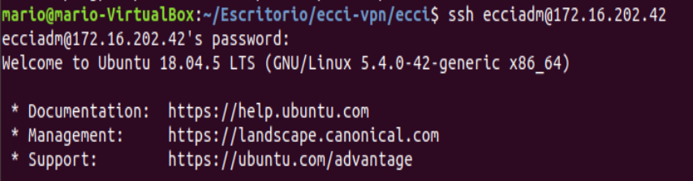
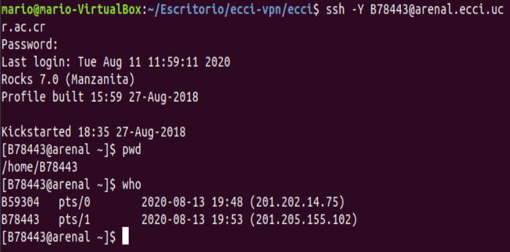

# Manual de instrucciones - Configuración de servidores

  

## Datos:

Nombre: Mario Alberto Víquez González

Carné: B78443

Curso: Proyecto Integrador de Sistemas Operativos y Redes de Comunicación de Datos.

Grupo : 01

Fecha : 13/08/2020

  

# Notas de Clase

Primeramente, los profesores se encargan de asignar a cada estudiante un número de IP correspondiente a la máquina virtual con la cual trabajar, en mi caso, la que se encontraba asignada a mi carnet corresponde a 172.16.202.42.

Una vez asignada la máquina se nos pide configurar una VPN para poder acceder a las máquinas virtuales, para ello se hizo uso del siguiente comando **sudo apt-get install openvpn** , con la finalidad de descargar e instalar dicha vpn.

Posterior a esto, es necesario configurarla, para ello, necesitamos descargar un paquete de archivos desde la plataforma de mediación virtual, que fueron suministrados por Carlos Lobo. 

Una vez descargados, nos dirigimos al directorio que posee estos archivos y dentro del mismo ingresamos el siguiente comando **sudo openvpn -- config ecci.ovpn** (para los usuarios de Windows se da la opción de descargar la aplicación correspondiente a OpenVPN, e ingresar el archivo ecci.opvn para configurarlo manualmente), después se nos pide tanto la contraseña de la máquina, así como también el nombre de usuario y contraseña Auth, si las agregamos correctamente el indicativo de que la máquina ya puede ser utilizada es que nos aparecerá un mensaje que dice lo siguiente **Initialization Sequence Completed**, el cual se mantendrá en ejecución, es importante destacar que esta pestaña de terminal donde realizamos estos procesos debe mantenerse de esta forma y que para acceder a las máquinas virtuales debemos de abrir una nueva ventana o pestaña de terminal, de lo contrario no será posible (no se debe cerrar o detener la ejecución de dicha terminal).

  

Una vez configurada la vpn y abierta una nueva pestaña, se nos pide realizar una prueba mediante el comando **ping 172.16.202.42** , que en términos generales se encarga de verificar el estado de una determinada conexión de un host local. Para acceder a las máquinas se ingresa el comando **ssh ecciadm@ 172.16.202.42** y aceptamos la autenticidad si es la primera vez que ingresamos a través de esta máquina.

 

 

Se asignó una contraseña por defecto para todas las máquinas la cual fue "admin", mediante el comando **passwd** se puede hacer un cambio de contraseña, para el cual todos los estudiantes tenían que hacer un cambio durante la clase y escoger la contraseña que gusten.

Para acceder al cluster arenal se nos han enviado la información a través de un correo, el comando para poder acceder al cluster es el siguiente **ssh -Y usuario@arenal.ucr.ac.cr** en donde "usuario" es el carnet, con la letra inicial en mayúscula. La contraseña también fue enviada en el correo, y es importante asegurarse de no fallar más de tres veces, ya que de ser así, el sistema le penalizará con alrededor de una hora de espera para poder intentarlo de nuevo.

Y para finalizar la clase, se nos habla de dos comandos los cuales son **pwd** y **who** que permiten devolver la ruta en la que estás situado y verificar cuantos usuarios se encuentran conectados en dicha máquina respectivamente.

