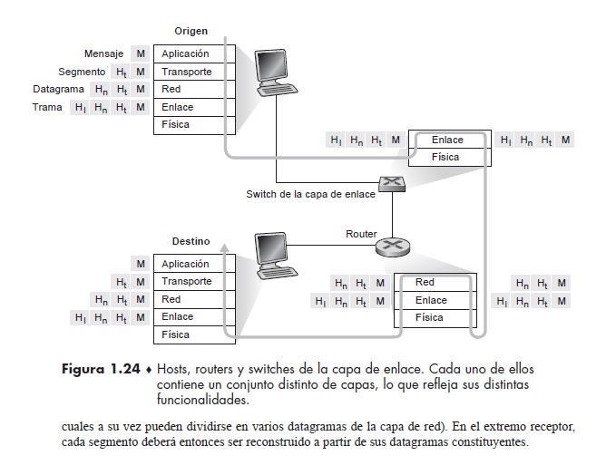

# Tarea Corta #1

  

  

## Capítulo 1 - Redes de computadoras e Internet.

  

  

## Datos:

  

  

**Nombre:** Mario Alberto Víquez González

  

  

**Carné:** B78443

  

  

**Curso:** Redes de Comunicación de Datos.

  

  

**Grupo:** 01

  

  

**Fecha:** 25/08/2020

  

  

## Del libro de texto, capítulo 1, resuelva los ejercicios R1, R8, R11, R18, R20 y R25.

  

### Ejercicio R1

**¿Cuál es la diferencia entre un host y un sistema terminal?**

  

No hay diferencia, ambos términos hacen referencia a un conjunto de nodos, computadoras o dispositivos que se encuentran conectados a una red que proveen y utilizan servicios de ella, los cuales ofrecen servicios de transferencia de archivos y conexión remota a otros computadores a los que se les llama clientes. Las dos palabras son utilizados de manera indistinta (sinónimos).

  

**Enumere distintos tipos de sistemas terminales.**

  

Cualquier dispositivo que se encuentre conectado a una red puede ser un host, unos ejemplos pueden ser los siguientes: Computadoras portátiles, teléfonos inteligentes, tabletas, televisores, consolas de juegos, termostatos,

sistemas domésticos de alarma, electrodomésticos, relojes, vehículos, sistemas de control de tráfico y otros.

  

**¿Es un servidor web un sistema terminal?**

  

Un servidor web no es un sistema terminal porque, precisamente, es el encargado de ofrecer servicios a los sistemas terminales. La diferencia es que un servidor web es un equipo o máquina (física o virtual) que está conectada a Internet y ofrece diversos recursos, y un host es solo un espacio de almacenamiento dentro del servidor que utiliza ciertos recursos técnicos del mismo.

  

### Ejercicio R8

**Cite algunos de los medios físicos sobre los que se puede emplear la tecnología Ethernet.**

  

En la actualidad , Ethernet se ejecuta con mayor frecuencia sobre cables de cobre de par trenzado. También puede correr sobre enlaces de fibras ópticas.

  

### Ejercicio R11

**Suponga que hay un único dispositivo de conmutación de paquetes entre un host emisor y un host receptor. Las velocidades de transmisión entre el host emisor y el dispositivo de conmutación y entre este y el host receptor son R1 y R2, respectivamente. Suponiendo que el switch utiliza el mecanismo de conmutación de paquetes de almacenamiento y reenvío, ¿cuál es el retardo total extremo a extremo si se envía un paquete de longitud L? (Ignore los retardos de cola, de propagación y de procesamiento.)**

  

En el momento T0: El anfitrión o host emisor comienza a transmitir.

  

En el momento T1: L / R1. El anfitrión emisor termina de enviar completa la transmisión y el paquete completo se recibe en el enrutador (ahí es donde se encuentra el paquete completo). Debido a que el enrutador tiene el paquete completo en el momento T1 , puede comenzar a transmitir el paquete al host receptor en el momento T1.

  

En el momento T2: T1 + L/ R2. El enrutador termina de completar la transmisión y enviar el paquete ( es re concebido en el host receptor) y el host receptor tendrá el paquete completo.

  

Esto explica entonces que el retardo de un extremo a otro es **L / R**.

  

### Ejercicio R18

**¿Cuánto tiempo tarda un paquete cuya longitud es de 1.000 bytes en propagarse a través de un enlace a una distancia de 2.500 km, siendo la velocidad de propagación igual a 2,5 · 108 m/s y la velocidad de transmisión de 2 Mbps? De forma más general, ¿cuánto tiempo tarda un paquete de longitud L en propagarse a través de un enlace a una distancia d, con una velocidad de propagación s y una velocidad de transmisión de R bps?**

  

Longitud ( L )= 1000 bytes

Distancia ( d ) = 2500 km

Velocidad de propagación ( s ) = 2.5· 108 m/s

Velocidad de transmisión ( R )= 2 Mbps

  

Habiendo ordenado los datos suministrados, la operación quedaría de esta manera.

  

2500 Km / 2,5 * 10^8 m/s = 0.01 s

  

Donde los valores convertidos son los siguientes:

  

2,5 * 10^8 m/s = 250 000 000 m/s.

2500 km = 250 0000 m

  

250 0000 m / 250 000 000 m/s = 0.01 s

  

Dado que en las redes de área extensa, los retardos de propagación son del orden de milisegundos, procedemos a realizar las respectivas conversiones en la misma escala o unidad de medida y el resultado da **10 ms**.

  

0.01 s x 10^3 = 10 ms

  

**¿Depende este retardo de la longitud del paquete? ¿Depende este retardo de la velocidad de transmisión?**

  

El ejercicio habla sobre el tiempo que dura un paquete en propagarse, por lo que hace referencia al retardo de propagación, que es igual a la distancia entre dos routers (router A y el router B) dividida por la velocidad de propagación del enlace (d/s). Por eso, la longitud del paquete y la velocidad de transmisión del enlace no tienen nada que ver con el retardo de propagación. Por lo tanto, la respuesta a ambas preguntas es **no**.

  

### Ejercicio R20

**Suponga que el sistema terminal A desea enviar un archivo de gran tamaño al sistema terminal B. Sin entrar en detalles, describa cómo crea el sistema terminal A los paquetes a partir del archivo.**

  

El proceso actúa de la siguiente manera, el sistema terminal A divide el archivo grande en fragmentos (básicamente, cuando un sistema terminal tiene datos que enviar a otro sistema terminal, el emisor segmenta los datos y añade bytes de cabecera a cada segmento). Agrega encabezado a cada fragmento, por lo que genera múltiples paquetes desde el archivo. El encabezado de cada paquete incluye la IP de dirección del destino (sistema final B).

  
  

**Cuando uno de estos paquetes llega a un conmutador de paquetes, ¿qué información del paquete utiliza el conmutador para determinar el enlace por el que debe ser reenviado el paquete?**

  

El conmutador de paquetes usa la información de la IP de destino de dirección en el paquete para determinar el enlace de salida (por el que debe ser reenviado el paquete).

La información que plantea el libro con respecto a la pregunta es la siguiente.

"Un conmutador de paquetes toma un paquete que llega a través de uno de sus enlaces de comunicaciones de entrada y lo reenvía a través de a uno de sus enlaces de comunicaciones de salida."

  

**¿Por qué la conmutación de paquetes en Internet es análoga a viajar de una ciudad a otra preguntando por la dirección a la que nos dirigimos?**

  

Esta situación es análoga a viajar de una ciudad a otra, pues aunque el viajero pregunta por la dirección de destino final, los habitantes le dirán qué salida debe tomar para llegar a su destino (es análogo a un paquete que pregunta en qué enlace de salida se debe reenviar).

  
  

### Ejercicio R25

**¿Qué capas de la pila de protocolos de Internet procesa un router?**

  

La pila de protocolos de Internet consta de cinco capas: capa física, capa de enlace, capa de red, capa de transporte y capa de aplicación.

  

En particular, **un router** procesa 3 capas, las capas de red, enlace y capas física.

  

**¿Qué capas procesa un switch de la capa de enlace?**

  

Un **switch** de la capa de enlace , procesa lógicamente la capa de enlace y la capa física.

  

**¿Qué capas procesa un host?**

  

Los **hosts** procesan las cinco capas ( capa física, capa de enlace, capa de red, capa de transporte y capa de aplicación).

  

En la siguiente imágen se puede apreciar mejor las capas que procesa cada uno de los elementos citados anteriormente.

  

PD: La imagen fue obtenida del libro de Redes de Computadoras.

Kurose, J., & Ross, K. W. (2017). Redes de computadoras e Internet (pp. 46 - 47). _Redes de computadoras_ (Vol. 7). Pearson Educación.

  

  
  

## Referencias

  

- #### Tanenbaum, A. S. (2003). _Redes de computadoras_. Pearson educación.

- #### Kurose, J., & Ross, K. W. (2010). _Redes de computadoras_ (Vol. 5). Pearson Educación.
