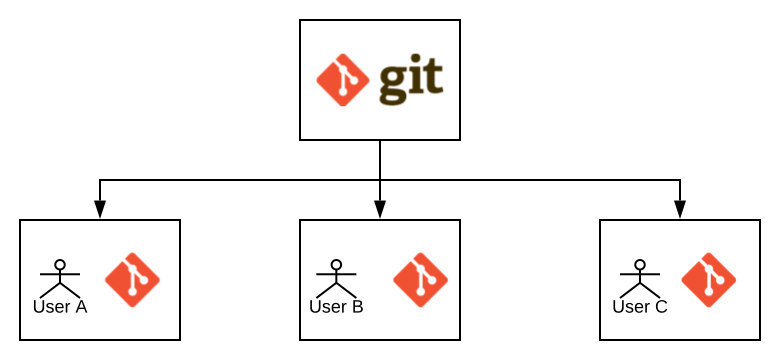

# Manual de instrucciones - Comandos de Linux y Git

  

  

## Datos:

  

Nombre: Mario Alberto Víquez González

  

Carné: B78443

  

Curso: Proyecto Integrador de Sistemas Operativos y Redes de Comunicación de Datos.

  

Grupo : 01

  

Fecha : 14/08/2020

  

  

# Notas de Clase

  

## Parte 1 - Linux

Durante esta clase se retomó algunos comandos que vimos de la clase pasada, se detalló un poco más sobre el comando **ping** en esta ocasión, se nos dice que funciona para medir el tiempo que tarda en comunicarse (Latencia).

Se nos hace una introducción al comando **useradd**, con el cual, se puede crear usuarios desde una terminal, antes de crear un usuario, se ingresa el comando **useradd --help**, este nos desplegará los diferentes modos de uso o bien

  
	
	mario@mario-VirtualBox:~$ useradd --help

	Modo de uso: useradd [opciones] USUARIO

	useradd -D

	useradd -D [opciones]

	Opciones:

	-b, --base-dir DIR_BASE directorio base para el directorio personal  

	de la nueva cuenta  

	-c, --comment COMENTARIO campo GECOS de la nueva cuenta 

	-d, --home-dir DIR_PERSONAL directorio personal de la nueva cuenta
	
	-D, --defaults imprime o cambia la configuración

	predeterminada de useradd
	
	-e, --expiredate FECHA_CADUCIDAD fecha de caducidad de la nueva cuenta

	-f, --inactive INACTIVO periodo de inactividad de la contraseña

	de la nueva cuenta

	-g, --gid GRUPO nombre o identificador del grupo primario de

	la nueva cuenta

	-G, --groups GRUPOS lista de grupos suplementarios de la nueva

	cuenta

	-h, --help muestra este mensaje de ayuda y termina

	-k, --skel DIR_SKEL utiliza este directorio «skeleton» alternativo

	-K, --key CLAVE=VALOR sobrescribe los valores predeterminados de

	«/etc/login.defs»

	-l, --no-log-init no añade el usuario a las bases de datos de

	lastlog y faillog

	-m, --create-home crea el directorio personal del usuario

	-M, --no-create-home no crea el directorio personal del usuario

	-N, --no-user-group no crea un grupo con el mismo nombre que el

	usuario

	-o, --non-unique permite crear usuarios con identificadores

	(UID) duplicados (no únicos)

	-p, --password CONTRASEÑA contraseña cifrada de la nueva cuenta

	-r, --system crea una cuenta del sistema 

	-R, --root CHROOT_DIR directorio en el que hacer chroot

	-s, --shell CONSOLA consola de acceso de la nueva cuenta

	-u, --uid UID identificador del usuario de la nueva cuenta

	-U, --user-group crea un grupo con el mismo nombre que el

	usuario

	-Z, --selinux-user USUARIO_SE utiliza el usuario indicado para el usuario

	de SELinux

	--extrausers Use the extra users database

  

Una vez visto el listado de opciones, ingresamos a nuestras máquinas virtuales como lo hemos hecho hasta ahora y procedemos a ingresar el comando con la opción **sudo useradd -m USER**, el cual crea el directorio personal del usuario que vamos a crear, y procedemos a ingresar, típicamente se escoge las iniciales del primer nombre y de los apellidos. Nos pedirá la contraseña del usuario en el que nos encontramos actualmente y procedemos a hacerlo

Una vez creado, cambiamos de usuario a través del comando **su USER** y procedemos a darle una contraseña con el comando **passwd** con el cual ya hemos trabajado anteriormente.

Es importante destacar que al estar en un super shell o ssh, (el cual es un protocolo que permite el acceso remoto a un servidor por medio de un canal seguro en el que toda la información está cifrada), resulta en ocasiones molesto no poder recurrir a diferentes comandos anteriores como se hace típicamente con la flecha superior, es por esto que una opción muy práctica es utilizar el comando **bash** , gracias a esto podemos recurrir a diferentes comandos y a los ya utilizados con anterioridad.

  
	Could not chdir to home directory /home/ecciadm: No such file or directory

	$ su mvg

	Password:

	$ cd

	$ bash

	mvg@CI0121:~$

Una vez cambiado de usuario , ingresamos el comando **ls** , el cual permite ver rápidamente todos los archivos dentro del directorio especificado, y su versión **ls -la** el cual, permite visualizar un listado más largo de archivos, así como también los que encontramos ocultos en la máquina (los archivos inician con punto).

  

	mvg@CI0121:~$ ls

	examples.desktop team-computin

	mvg@CI0121:~$ ls -la

	total 56

	drwxr-xr-x 6 mvg mvg 4096 ago 11 11:21 .

	drwxr-xr-x 4 root root 4096 ago 11 09:20 ..

	-rw------- 1 mvg mvg 795 ago 14 18:12 .bash_history

	-rw-r--r-- 1 mvg mvg 220 abr 4 2018 .bash_logout

	-rw-r--r-- 1 mvg mvg 3771 abr 4 2018 .bashrc

	drwx------ 2 mvg mvg 4096 ago 11 09:30 .cache

	-rw-r--r-- 1 mvg mvg 8980 abr 16 2018 examples.desktop

	-rw-rw-r-- 1 mvg mvg 68 ago 11 11:02 .gitconfig

	drwx------ 3 mvg mvg 4096 ago 11 09:30 .gnupg

	drwxrwxr-x 3 mvg mvg 4096 ago 11 10:44 .local

	-rw-r--r-- 1 mvg mvg 807 abr 4 2018 .profile

	drwxrwxr-x 3 mvg mvg 4096 ago 11 11:20 team-computin

  

Como se pueden observar, nos despliega, además de los archivos, una serie de columnas que tienen significados específicos, la primera nos indica si es un directorio de archivos corriente, luego tenemos las columnas de usuario y de grupos, las letras en particular de **drwx** determinan los permisos que estos tienen, **d** si es un directorio normal, **r** permisos de lectura, escritura, **w** permisos de escritura y **x** permisos de ejecución.

Estos permisos de archivos o de directorios se pueden cambiar con el comando **chmod**

  

Otro comando interesante es el **cd** , su nombre radica de **change directory** y hace exactamente eso, cambia de directorio a uno especificado, si solamente escribimos **cd** sin parámetros, este volverá al directorio home.

Se hace alusion al **/var**, el cual no es más que un sistema de archivos que contiene datos temporales

  

## Parte 2 - Git

Para esta parte se nos da una introducción sobre lo que es un repositorio de control de versiones, los cuales tienen múltiples ventajas, como por ejemplo permiten controlar las distintas versiones del código, trabajar de forma independiente sin afectar los cambios de los otros compañeros, guardar cambios, se puede experimentar entre otros. Normalmente es lo que la industria más utiliza, por ello es importante aprender a utilizarlos.

Primeramente ingresamos el comando **sudo apt update**, el cual descarga información de los paquetes y verifica si existen actualizaciones de los mismos, y posteriormente ingresamos el comando **sudo apt install git**, en caso de que no se tenga la configuración de comandos correspondiente para poder usar este control de versiones.

Después, procedemos a crear un repositorio, en este caso lo haremos desde la página de GitLab y cuando lo tengamos hecho, copiamos la dirección HTTPS que posee para posteriormente clonar dicho repositorio mediante el comando **git clone https://git.ucr.ac.cr/team-computin/team-computin.git**

Mediante este comando cualquier persona podrá tener una copia local del repositorio en cualquier dispositivo.

  

  

Al crear un repositorio, git crea un archivo README.md por defecto, para poder editarlo podemos usar el editor de texto **nano** y agregar datos o información que desee

Podemos ver todos los archivos que contienen cambios efectuados con el comando **git status** , y posterior a ello, el comando **git add file** y el archivo que se quiere agregar al repositorio, si existe algún arrepentimiento se puede quitar ese archivo al poner **git checkout -- file**

  

	mvg@CI0121:~/team-computin$ git status

	On branch master

	Your branch is up to date with 'origin/master'.

	nothing to commit, working tree clean

  

Con los comandos **git config --global user.name "Nombre"** y **git config --global user.email correo@example.com** se puede cambiar su nombre y dirección de correo electrónico.

  

Cuando se quiera subir un archivo a nuestro repositorio, es necesario especificar un poco el contenido o los cambios efectuados al trabajo para que otros pueden tener más claro como proceder a los mismos, o bien no alterar el trabajo, esto se logra a través de un commit, para hacer un commit se utiliza el comando **git commit -m "Mensaje significativo"**, es importante que sea precisamente algo entendible, claro y breve, y cuando ya estemos seguros de lo que queramos subir, basta con escribir el comando **git push**, posteriormente ingresar el nombre de usuario y contraseña correspondientes al usuario.

  

Por último, una buena práctica es actualizar constantemente el contenido de la copia local que tenemos del repositorio, para así evitar merge conflicts, esto se hace mediante el comando **git pull**, con este comando, se trae el contenido del repositorio y actualizar la versión que tenemos en nuestras maquinas.
