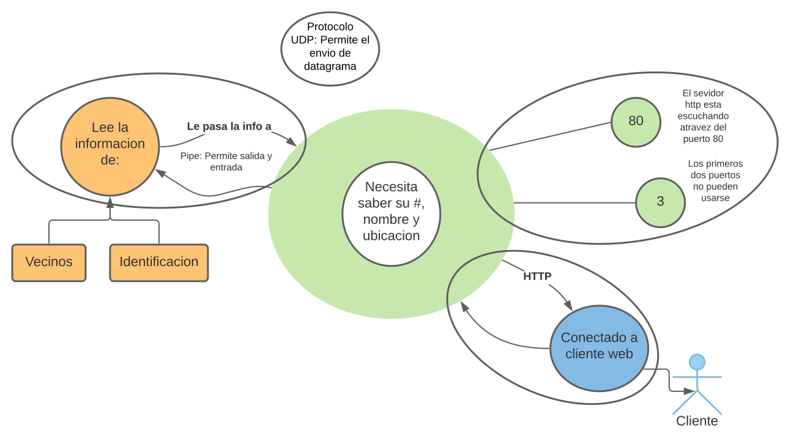

# Análisis personal del Proyecto Integrador de Redes - Oper

  

## Estudiante : Mario Alberto Víquez González

  

## Descripción General

El objetivo es armar una red overlay o lo que se conoce como una red virtual de nodos, los cuales se encuentran lógicamente enlazados y se mantiene funcional sobre otra red. En esta red, los nodos van a estar conectados por una topología arbitraria , es decir, los nodos de red se interconectan por medio algún medio de comunicación.

  

## Fase 1

A nivel de fase 1 se pretende una visión global del proyecto, no es necesario especificar una topología arbitraria desde un comienzo, de hecho se menciona que se van a realizar diferentes pruebas con varias topologías para encontrar la que más se acople a lo que buscamos.

  

Vamos a trabajar con diferentes tipos de nodos durante el desarrollo del proyecto a los cuales se les ha asignado un color para entender mejor esta primera fase (verde, azul, naranja).

  

Se pretende que se lea la topología de la red, y así mismo, que se maneje el envío de mensajes sencillos de máximo 200 caracteres, estos se enviaron entre un nodo verde y los nodos cercanos más próximos, el objetivo es familiarizarse con las herramientas de red.

  

El tipo de nodo más importante es el que denominamos como **verde**, este va a ser el principal y el que arma toda la red en general, sin embargo, este nodo tiene la particularidad de que es necesario indicarle la **ubicación** que este debe de tener en la red y el **nombre**, ya que en un inicio, no posee esa información. Un objetivo importante de esta fase es precisamente aprender a como pasarle esta información, esto se hace mediante la creación de otro nodo al cual denominamos **naranja**, y va a ser el encargado de establecer la topología de la red, esto se hace mediante un **pipe** (cadena de procesos conectados donde la salida de cada elemento de la cadena es la entrada del próximo) de entrada y de salida con el proceso original. Otro rol importante del nodo **naranja** es el de leer los diferentes archivos (concretamente la identificación) que podemos encontrar en el directorio (cumple el rol de intérprete) y uno de estos va a ser la identidad del nodo.

  

Algunas opciones para poder conectar los nodos naranjas con los verdes es a través de memoria compartida, por paso de mensajes, buzones, a través de señales, por sockets etc.

  

Cuando el nodo **naranja** conozca esta información, este debe de pasarse al verde para que se pueda empezar a dar forma a la red.

  

Existen otros nodos los cuales los denominamos **azules** que se encargan básicamente de ser los clientes, estos van a poder enviar mensajes a través de los nodos **verdes** usando una interfaz web. Y mediante un servidor de tipo HTTP (este protocolo funciona de tal forma que responde solicitudes), de forma tal que un cliente empieza a hacer solicitudes a través de páginas HTML, esto último se debe de resolver a través de un socket de web, ya que estos pueden enviar y recibir mensajes. Se debe también de implementar la comunicación HTTP y el web socket, ya que si solo se hace el HTTP, será una espera activa
  

La comunicación con los nodos **azules** es independiente de los **naranjas**, es decir, se establecen enlaces hacia ellos.

  

Se establece que la comunicación normal del nodo **verde** con los vecinos es a través de un protocolo que se denomina **User Datagram Protocol** o **UDP**, el cual, permite el envío de datagramas sin establecer una conexión previa. Este protocolo es muy ventajoso, ya que los paquetes pueden llegar de manera desordenada y dicho protocolo se encarga de organizarlos. Se elige precisamente este protocolo por ser el más sencillo y ser los mejor portados

  

La comunicación con los **vecinos verdes** es a través de UDP, y es necesario que haya un nodo **naranja** para poder establecer comunicación con cada uno de los verdes vecinos

  

Algo a tener en cuenta para esta fase es que se debe de tener varios elementos para poder establecer comunicación, entre ellos están los vecinos (más concretamente el número identificador que este posee), la dirección IP (en la versión primitiva, para poder buscar ese vecino) y el puerto UDP en el que está el servicio. El objetivo de la fase 1 es precisamente aprender a conectar y enlazar estos nodos **(solo se va a comunicar el nodo verde con sus vecinos más próximos)**, esto mediante una lista de vecinos donde el nodo principal podrá escoger a qué nodo escribir y enviar el mensaje. Se establece que por convención va a ser de 2 Bytes.

## Imagen ilustrativa de la red a construir
  

## Dudas

  

Cuales son las diferencias entre los llamados v1, v2 y el cliente?

Como se implementa la comunicacion HTTP, o en que consiste?

El nodo naranja sabe por defecto su propia ubicación o lugar en la red?
